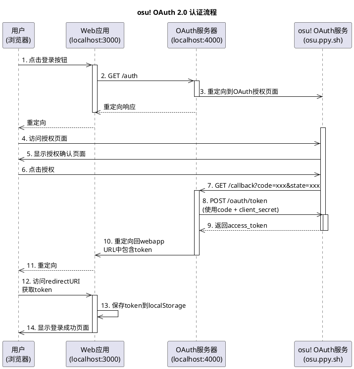
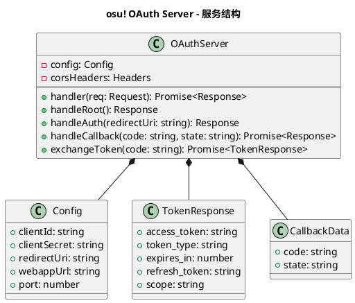
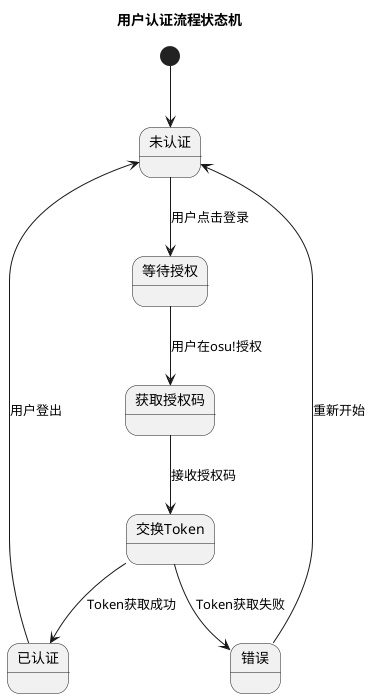
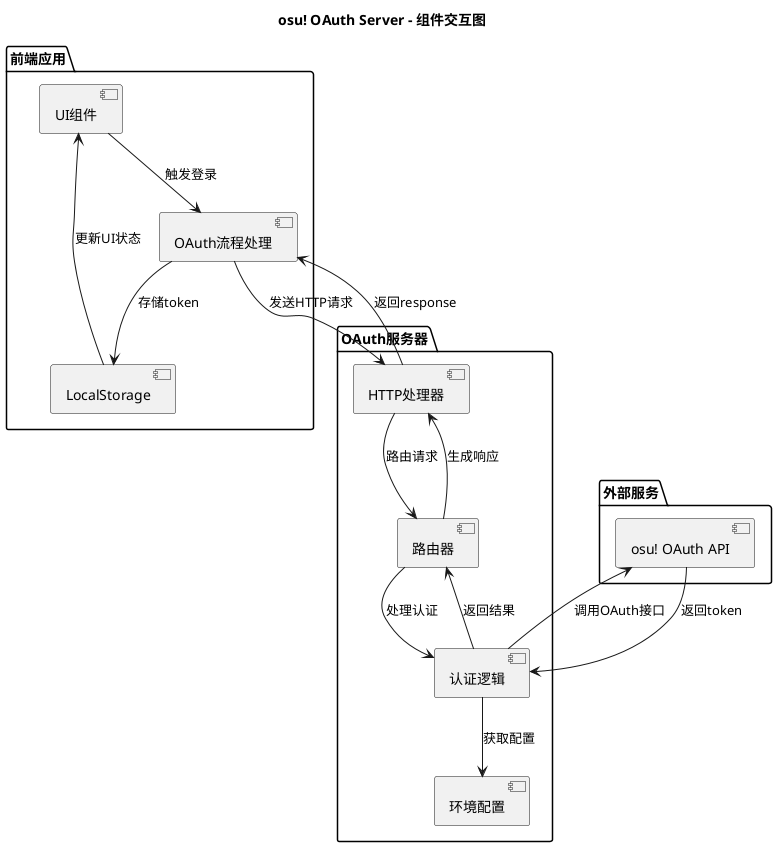
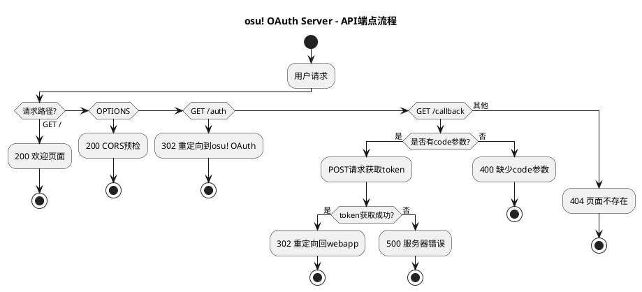
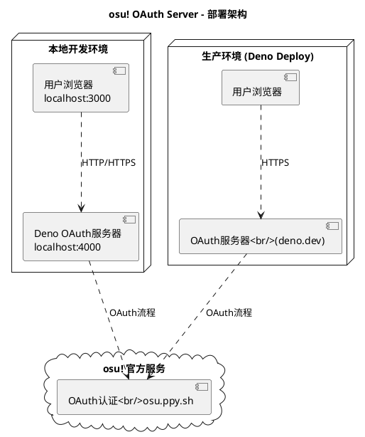
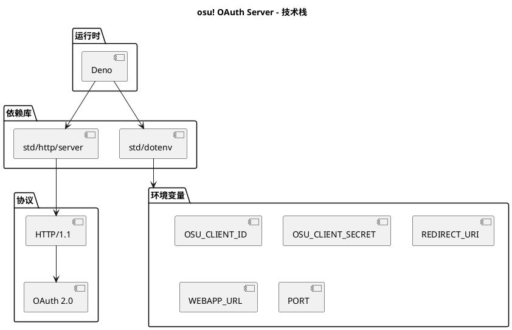

# PlantUML 架构和流程图

## C4 架构图 - System Context

```plantuml
@startuml C4_Context
!include https://raw.githubusercontent.com/plantuml-stdlib/C4-PlantUML/master/C4_Context.puml

title osu! OAuth Server - System Context

Person(user, "用户", "需要在应用中登录osu账户")
System(webapp, "Web应用", "使用OAuth进行用户认证的Web应用")
System(oauth_server, "osu! OAuth\n服务器 (Deno)", "处理OAuth认证流程")
System_Ext(osu_auth, "osu! OAuth\n授权服务", "osu官方提供的OAuth2认证服务")

Rel(user, webapp, "访问应用")
Rel(webapp, oauth_server, "发起OAuth登录")
Rel(oauth_server, osu_auth, "请求授权")
Rel(osu_auth, oauth_server, "返回授权码")
Rel(oauth_server, webapp, "重定向并传递token")
Rel(webapp, user, "登录成功")

@enduml
```

## C4 架构图 - Container

```plantuml
@startuml C4_Container
!include https://raw.githubusercontent.com/plantuml-stdlib/C4-PlantUML/master/C4_Container.puml

title osu! OAuth Server - Container Diagram

Person(user, "用户", "需要认证的用户")
Container(webapp, "Web应用", "JavaScript/TypeScript", "用户访问的前端应用\n运行在localhost:3000")
Container(oauth_server, "OAuth服务器", "Deno/TypeScript", "处理OAuth流程的后端服务\n运行在localhost:4000")
System_Ext(osu_auth, "osu! OAuth服务", "提供OAuth认证的官方服务")

Rel(user, webapp, "使用浏览器访问")
Rel(webapp, oauth_server, "1. GET /auth")
Rel(oauth_server, osu_auth, "2. 重定向到授权页面")
Rel(osu_auth, user, "3. 显示授权页面")
Rel(user, osu_auth, "4. 用户授权")
Rel(osu_auth, oauth_server, "5. 回调 /callback + code")
Rel(oauth_server, osu_auth, "6. 使用code获取token")
Rel(osu_auth, oauth_server, "7. 返回access_token")
Rel(oauth_server, webapp, "8. 重定向回webapp + token")
Rel(webapp, user, "9. 登录成功")

@enduml
```

## UML 序列图 - OAuth流程



## UML 类图 - 服务结构



## UML 状态图 - 用户认证状态



## 组件交互图



## API端点流图



## 部署架构



## 技术栈图


